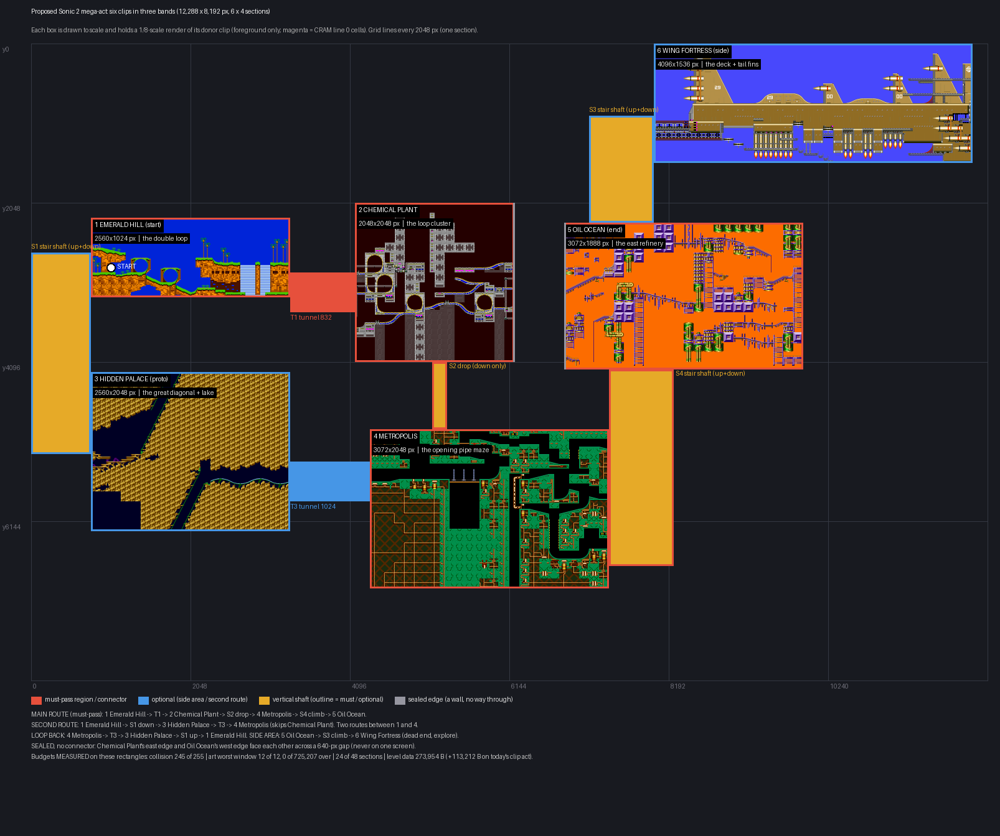

# The Sonic 2 mega-act: a 2-D layout proposal

**Date:** 2026-09-27. **Branch:** `design/s2-mega-act-layout`, base `origin/master` `6f30b5ce`.
**Booking:** `docs/DEFERRED_WORK.md`, S2-COMPRESSED-ACT (pointer added there).
**Status:** a PROPOSAL for the owner to react to. Nothing here is built. No engine file, no
tool under `tools/`, no ROM byte changed. No emulator was used.

**The picture:** [`2026-09-27-mega-act-layout/mega-act-layout.png`](2026-09-27-mega-act-layout/mega-act-layout.png).
Every box is drawn to scale (1 px = 8 world px) and holds a render of the donor clip that
would be pasted there.



**What the owner asked for (2026-09-27):** *"make like a larger level with different parts of
our 6 levels planned stitched throughout. So it feels like a pretty large act and there's
different ways to get to the different parts. Sometimes you have to pass through, other times
it's exploring and seeing a section… I want it to wow people what the engine can do with
stitching and feel like the levels are kind of right next to each other."* And: *"the map in
my head isn't down it's just like I want it to showcase that these aren't like just lined up,
that regions can be any boxes anywhere. This is just one big act for now. We don't need
objects just yet."*

Every figure below is tagged. **MEASURED** means a command in §9 printed it. **INFERRED** means
arithmetic on measured numbers or a reading of source, and the sentence says which.

---

## 0. The proposal in one screen

- **One act, 12,288 x 8,192 px (6 x 4 sections, 24 of the 48 allowed), in three bands:** sky,
  surface, underground.
  - **Sky:** Wing Fortress, top right. A side area.
  - **Surface:** Emerald Hill (the start) on the left, then Chemical Plant, then Oil Ocean on
    the right.
  - **Underground:** Hidden Palace under Emerald Hill, Metropolis under Chemical Plant.
- **Main route (must-pass):** Emerald Hill, tunnel T1, Chemical Plant, drop shaft S2,
  Metropolis, stair shaft S4 up, Oil Ocean.
- **Second route:** Emerald Hill, stair shaft S1 down, Hidden Palace, tunnel T3, Metropolis. It
  skips Chemical Plant, so there are **two routes between Emerald Hill and Metropolis**.
- **Loop back:** Metropolis, T3, Hidden Palace, S1 up, Emerald Hill.
- **Side area:** from Oil Ocean, stair shaft S3 climbs to Wing Fortress. It is a dead end, there
  to be explored.
- **Budgets, MEASURED on the real rectangles** by the clip bake itself (`tools/clip_act_bake.py`):
  - collision: **245 of 255** attr entries;
  - art: worst camera window **12 of 12** page frames, **0 of 725,207** windows over;
  - zone separation: **0 of 725,207** tile-cache windows hold two zones;
  - sections: **24 of 48**;
  - level data: **273,954 B**, which is **+113,212 B** on today's two-zone clip act. That moves
    the clip act's own bank anchors (a routine re-derive) and is far inside the 4 MB map.
- **It does not build today, and the blockers are the bake, not the engine.**
  - The engine's regions, crossings, background swap, music switch, layer lines, tile cache and
    collision lookup already work in two dimensions (§2).
  - The Python clip bake assumes one left-to-right row and refuses a stacked act by name.
  - §6 lists 17 missing pieces with sizes. The two large ones are a 2-D region plan and a
    vertical connector kind.
- **The decisions for the owner are in §8.**

---

## 1. Part 1: the four remaining zones convert cleanly

`python3 tools/s2_zone_convert.py convert s2disasm@WFZ s2disasm@OOZ s2disasm@MTZ
s2-simonwai-disasm@HPZ` (EHZ and CPZ were converted in the same run), then `verify` on all six
trees. **No converter change was needed.** The trees are gitignored; this section is the record.

| Zone (donor) | Grid | Level tiles | Painted cells | Round trip | Collision cells compared | Attr entries (whole zone) | CRAM line 0 cells |
|---|---|---|---|---|---|---|---|
| WFZ (final) | 8 x 1 | 889 | 101,812 | 524,288 cells, **0 differing** | 1,048,576, **0 differing** | 108 | 104 |
| OOZ (final) | 7 x 1 | 681 | 94,047 | 368,160, **0** | 736,320, **0** | 67 | 0 |
| MTZ (final) | 5 x 1 | 792 | 203,818 | 292,864, **0** | 585,728, **0** | 62 | 0 |
| HPZ (Simon Wai prototype) | 8 x 1 | 725 | 166,680 | 524,288, **0** | 1,048,576, **0** | 152 | 0 |
| EHZ, CPZ (for completeness) | 6 x 1 each | 914 / 867 | 119,231 / 112,906 | **0 / 0** | **0 / 0** | 105 / 160 | 0 / 698 |

All MEASURED. `verify`: 6 trees, 0 FAILED. `pytest tools/test_s2_zone_convert.py`: 18 passed.

**Collision equivalence, the slope parcel's way, per zone.** The slope parcel's probe
(`docs/research/2026-09-26-sonic-slope-collision/s2_collision_equivalence.py`) reads the clip
act's manifest, so it only covers EHZ and CPZ. The new
[`s2_zone_collision_equivalence.py`](2026-09-27-mega-act-layout/s2_zone_collision_equivalence.py)
is the same comparison over a whole converted tree, for either donor.
- **What it compares:** every 16-px block of the zone's crop, path 0 against plane A and path 1
  against plane B.
- **The Sonic 2 side:** Sonic 2's own runtime rule, written from `s2.asm` Find_Tile/FindFloor.
- **The aeon side:** the tree's cell words, read through the S2 bank.

| Zone | Blocks | Solid blocks compared | presence / top / lrb / angle / pixels / cell pair |
|---|---|---|---|
| EHZ | 87,808 | 9,395 | **0 / 0 / 0 / 0 / 0 / 0** |
| CPZ | 166,912 | 31,621 | **0 / 0 / 0 / 0 / 0 / 0** |
| WFZ | 262,144 | 7,104 | **0 / 0 / 0 / 0 / 0 / 0** |
| OOZ | 184,080 | 14,100 | **0 / 0 / 0 / 0 / 0 / 0** |
| MTZ | 146,432 | 23,093 | **0 / 0 / 0 / 0 / 0 / 0** |
| HPZ | 262,144 | 21,028 | **0 / 0 / 0 / 0 / 0 / 0** |

**0 differences in every zone (MEASURED).** The probe can fail: the controls corrupt the Sonic 2
side. Differences for WFZ / OOZ / MTZ / HPZ:
- ignoring the X-flip bit: 743 / 1,625 / 1,673 / 3,793;
- ignoring the Y-flip bit: 79 / 869 / 48 / 737;
- swapping the two paths: 13,500 / 28,200 / 46,186 / 42,056.

It is a research probe, as the slope parcel's was. It is not wired into a runner, and its
controls are command-line mutations rather than on-disk edits. That is a deviation from the
brief's rule 7, and it is named here rather than hidden.

**A finding that shapes the layout (MEASURED):** Oil Ocean, Metropolis and the prototype's
Hidden Palace have **zero plane-B solid cells**, and Sonic 2 agrees, because its path 1 is never
solid there. Wing Fortress has 732 plane-B cells. Two consequences, both in §6:
- those three zones need no plane switching at all;
- today's tunnel seam rule (K6) refuses to join one of them.

---

## 2. Why this is not a single row, and why that is now safe

The 09-17 design recommended **one horizontal section row** (§4, §9.4 of
`2026-09-17-s2-compressed-act-design.md`). It gave two reasons:
- "a 1-row act keeps the camera's vertical behaviour trivial", with every zone fitting 2048 px
  of height;
- the only argument it saw for a vertical stack was the raster palette split of §9.1(c).

The owner has now asked for the opposite. Both reasons were checked against what landed after
09-17 (READ from source, not run).

- **The engine was never row-only.**
  - **Region lookup:** `Region_Resolve` scans arbitrary x0/x1/y0/y1 rectangles for the camera
    centre (`engine/level/parallax.emp:1245-1260`, `:1342-1362`). There is no count cap:
    `act_region_count` is a u16.
  - **The shipped act:** Oracle Jungle act 1 is a 3 x 3 section grid with regions stacked in
    three rows.
  - **Vertical crossings:** a crossing is the same code on either axis. It installs the preset
    (and so the palette), switches parallax, posts `rg_song`, and swaps the background through
    `Region_Current`, with no axis test anywhere (`parallax.emp:1282-1312`, `bg.emp:639-803`).
    A vertical crossing was gated and closed on 2026-09-16
    (REGIONS-VERTICAL-CROSSING-ON-LANDING, `DEFERRED_WORK.md:35278`).
  - **Streaming:** the tile cache (80 x 60 cells) slides on both axes. Collision lookup wraps
    both ways. Backgrounds taller than the plane ship (BG-PLANE-WINDOW, closed 2026-09-16).
- **The palette seam does not need a raster split vertically.** It needs what it needs
  horizontally: a connector long enough that no screen holds two zones, with the crossing
  inside it.
  - A vertical shaft is that connector turned on its side.
  - The vertical version of the fade margin is INFERRED from the same constants: half the
    screen height (112) plus 16 frames at `CAM_MAX_Y_STEP` 16 = **368 px a side, 736 px a
    shaft**. The horizontal rule is 416 a side, 832 a corridor.
  - The proposal uses **768 px or more** between every vertically adjacent pair.
- **What IS row-only is the Python clip bake.**
  - `tools/clip_rom_bake.py` `region_plan` builds one strip per zone, left to right and full
    height. It refuses a stacked act by name: *"a stacked layout needs a horizontal crossing
    this bake does not write"* (`clip_rom_bake.py:910-926`).
  - The palette-margin check (Z2), the music check and reachability all walk x only.
  - The manifest itself is 2-D: the draft beside this file **validates** under
    `clip_manifest.py` (R1-R12).

So the single-row recommendation was a statement about the bake, not the engine. The proposal
below keeps the engine as it is and prices the bake work (§6).

---

## 3. The layout

### 3.1 The six clips

Clips were chosen by searching combinations under the collision cap (§5).
[`candidates.json`](2026-09-27-mega-act-layout/candidates.json) lists the 29 candidate
rectangles, and `measure_clips.py search` tries all 11,520 six-zone combinations. The chosen
set keeps a loop in both Emerald Hill and Chemical Plant, because those are what people
recognise.

**Every set-piece here is GEOMETRY, because there are no objects.** Chemical Plant's spin tubes,
Oil Ocean's fans and burners, Metropolis's screw nuts and Wing Fortress's platforms are objects
in Sonic 2. They will not appear or work. Their art is sometimes drawn in the foreground, for
example CPZ's tube art, but nothing moves the player through it. The design's §4 named fans and
screws as set-pieces; that is not possible yet and this proposal does not pretend otherwise.

| # | Zone | Set-piece (geometry) | Donor source rect (donor px) | Size | Act position | Route |
|---|---|---|---|---|---|---|
| 1 | **Emerald Hill** | the double loop, the waterfall ledges between them | `s2disasm` EHZ act 1, x 6144..8703, y 0..1023 | 2560 x 1024 | (768, 2240) | **must**, the start |
| 2 | **Chemical Plant** | the loop cluster: four loops over two levels | `s2disasm` CPZ act 1, x 7168..9215, y 0..2047 | 2048 x 2048 | (4160, 2048) | **must** on the fast route (bypassable by HPZ) |
| 3 | **Hidden Palace** | the great 45-degree diagonal and the underground lake | `s2-simonwai-disasm` HPZ act 1, x 5632..8191, y 0..2047 | 2560 x 2048 | (768, 4224) | optional, the second route |
| 4 | **Metropolis** | the opening pipe maze: quarter pipes, shafts, the lift wells | `s2disasm` MTZ act 1, x 0..3071, y 0..2047 | 3072 x 2048 | (4352, 4960) | **must** |
| 5 | **Oil Ocean** | the east refinery: tank towers, rails and long slides | `s2disasm` OOZ act 1, x 8192..11263, y 0..1887 | 3072 x 1888 | (6848, 2304) | **must**, the far end |
| 6 | **Wing Fortress** | the airship's deck and its three tail fins, with the thrusters underneath | `s2disasm` WFZ act 1, x 1024..5119, y 256..1791 | 4096 x 1536 | (8000, 0) | optional side area |

The placements and the donor rects are in [`draft_clips.json`](2026-09-27-mega-act-layout/draft_clips.json).
It is a `clips.json`-shaped file that `clip_manifest.py validate` accepts. Every paste shift is
a multiple of 16 px (R12).

### 3.2 The connectors

**Lengths.** The brief's rule is "corridors wider than the 640 px camera".
- 640 px is the tile cache's width (80 cells). The screen itself is 320 px.
- What the bake actually holds a connector to, on its default rule, is **832 px**: Z2's
  416-px fade margin on each side of the crossing. That also clears Z1's 632 px.
- Every horizontal connector below is **at least 832 px**. Every vertical one is **at least
  768 px** (the INFERRED vertical rule, §2).
- The owner's 384-px short tunnel (2026-09-25) is **not** used, because it does not scale to
  six zones. §5.3 has the measurement.

| Id | Kind | Joins | Rect (act px) | Direction | Route |
|---|---|---|---|---|---|
| T1 | tunnel (exists today) | EHZ east edge -> CPZ west edge | x 3328..4159, y 2944..3455, floor 3200 | both ways | **must** |
| T3 | tunnel (exists today) | HPZ east edge -> MTZ west edge | x 3328..4351, y 5376..5887, floor 5632 | both ways | optional |
| S1 | **stair shaft** (new) | EHZ west edge (floor y 2944) down to HPZ west ledge (floor y 5248) | x 0..767, y 2688..5279 | up and down | optional |
| S2 | **drop shaft** (new) | CPZ floor opening -> MTZ roof opening | x 5152..5343, y 4096..4959 | down only | **must** |
| S4 | **stair shaft** (new) | MTZ east edge (floor y 6720) up to OOZ floor opening | x 7424..8255, y 4192..6719 | up and down | **must** |
| S3 | **stair shaft** (new) | OOZ roof opening up to WFZ west dock (floor y 992) | x 7168..7999, y 928..2303 | up and down | optional |
| seal | **wall** (new) | CPZ east edge, OOZ west edge, across a 640-px gap | x 6192..6207 and 6848..6863 | none | n/a |

**The mouths are measured, not guessed.** For each clip, the edges where the donor is already
open were measured (air on plane A for 96 px inward, runs of at least 128 px). Every shaft mouth
sits on one of them, so no donor geometry has to be carved away:
- CPZ's floor edge is open at donor x 8064..9216, and MTZ's roof at donor x 800..992. MTZ is
  placed so the second opening sits under the first (S2).
- OOZ's floor edge is open at donor x 9216..10880 (S4 top mouth).
- OOZ's roof is open at donor x 8192..9344 (S3 bottom mouth).
- WFZ's west edge is open down to its dock at donor y 1248, the walkway Sonic 2 starts the zone
  on (S3 top mouth).
- EHZ's west edge is open down to its ground at donor y 704. HPZ's west edge is open down to a
  ledge at donor y 1024 (S1).
- **HPZ's roof has no opening at all** (MEASURED), which is why S1 enters it from the side.

The exact floor alignment of each mouth is a build-time detail. The tunnel seam rule (K6) will
refuse a mismatch of more than one block, and it already refused one (§6 item 9).

**Why a stair shaft.** Without objects there are no springs. A player cannot climb a plain
vertical shaft, so every up-connector must be walkable: ledges one jump apart, or a
switchback ramp. S2 is deliberately down-only, which is what makes the loop a loop rather than
a corridor.

### 3.3 The routes, restated

- **Pass through (must):** Emerald Hill, Metropolis and Oil Ocean are on every route to the
  end. So is one of Chemical Plant or Hidden Palace.
- **Explore (optional):** Wing Fortress is reachable only by choosing to climb S3, and it
  leads nowhere else. Hidden Palace is the road not taken on the fast route.
- **Two routes** from Emerald Hill to Metropolis: over the top through Chemical Plant, or
  underneath through Hidden Palace.
- **A loop:** Metropolis back to Emerald Hill through Hidden Palace and S1. A route that loops
  back needs **no engine work** (READ): crossing back into a region re-runs the same install
  path. What is not built is wrap-around ACT EDGES (`EDGE_WRAP_V` clamps,
  `player_common.emp:2546-2551`), and this proposal does not use them.
- **"Right next to each other":** every pair of neighbours is 640 to 1,024 px apart, which is
  one to two screens. Zones are never on one screen together (MEASURED, Z1: 0 of 725,207
  tile-cache windows hold two zones, a stricter test than the screen).

---

## 4. Budgets on the chosen rectangles

All from `tools/clip_act_bake.py bake` on `draft_clips.json` with T3 removed, because the bake
refuses T3 (§6 item 9). T3's art is the shared corridor sheet and its collision is the bank's
full block, which T1 already adds. INFERRED: removing T3 moves no count below.

| Budget | Limit | This act | Verdict |
|---|---|---|---|
| Collision attr set | 255 per act | **245** | fits, **10 spare** |
| Art: worst camera window | 12 page frames | **12**, 3,072 windows at 12, **0 of 725,207 over** | passes at the limit |
| Art pool | 256 pages (`PAGE_TABLE_MAX`) | **2,640 tiles, 42 pages** | fine |
| Zone separation (Z1, tile cache) | 0 mixed windows | **0 of 725,207** | passes, both axes |
| Sections | 48 (16 per axis) | **24** (6 x 4) | fine |
| Level data in ROM | clip act's own anchors, 4 MB map | **273,954 B** (block stream 229,490, local maps 9,202, art pool 35,262) | +113,212 B on today's act, see below |

**Collision, per clip (MEASURED):**

| Clip | Entries alone | Entries added, in bake order |
|---|---|---|
| EHZ double loop | 90 | 90 |
| CPZ loop cluster | 130 | 88 |
| HPZ diagonal + lake | 52 | 8 |
| MTZ opening | 43 | 35 |
| OOZ east | 45 | 17 |
| WFZ deck + fins | 100 | 7 |

- Emerald Hill and Chemical Plant together are 178 of the 245.
- The zones share most of their shapes. WFZ is 100 alone and adds only 7.
- **Cross-check with the budget tool:** `s2_clip_budget.py collision` on the section-aligned
  ranges that ENCLOSE each clip gives **254**. It is an upper bound, because that tool counts
  whole sections and full height. The six WHOLE zones give **362**, over by 107.

**Art (MEASURED).**
- The 12 is set by the act's shared page packing, not by any one zone. Each clip baked ALONE
  needs 6 (EHZ), 9 (CPZ), 6 (HPZ), 7 (MTZ), 8 (OOZ) and 9 (WFZ).
- The worst window of the whole act is inside Metropolis (camera 6456, 5536).
- **Cross-check with the budget tool:** `place` on the enclosing sections gives worst 12, 0 of
  349,783 over, 2,926 tiles in 49 pages.
- The design's caveat still stands: 12 of 12 leaves nothing for object art, which "objects
  later" will need.

**ROM (MEASURED data, INFERRED placement).**
- **How it was measured:** `measure_rom.py` runs the clip bake's own generators (strip gen,
  pool election, S4LZ block stream) into scratch directories.
- **Calibration:** the same harness gives today's `s2_ehz_cpz` act **160,742 B**. The mega-act
  is **273,954 B, +113,212 B**.
- **What that does to the anchors:**
  - Today's clip act has 23,854 B of growth before its DEBUG anchor rule moves from 0xC0000 to
    the next 0x8000 step (INFERRED: arithmetic on the measured packed ends in
    `s2_ehz_cpz/anchors.toml` under the rule in `clip_anchors.py`).
  - So +113 KB means re-deriving the clip act's own anchors (`clip_anchors.py --derive`), to
    about 0xE0000 (INFERRED). That is the routine the owner already ruled for (d-35-revised).
- **ROM is not the binding budget here.** The ROM region is 4 MB (`map.toml`), and the clip
  ROM would be about 1.06 MB (INFERRED).
- **Not counted:** backgrounds, palettes, presets, regions and songs for four more zones. Each
  background is a 4,096-B layout plus 32 B per tile (INFERRED from the measured tile counts in
  §5.3), about 6-12 KB per zone.

---

## 5. Where the ambition does not fit, and the trade

### 5.1 Collision is the one budget that says no

Unions MEASURED with `measure_clips.py union` (the same interning key as the bake). The
"doubled" row was also run through the bake, and its C2 refusal reports **279** by itself.

| Variant | Attr entries | Verdict |
|---|---|---|
| **The proposal** | **245** | fits, 10 spare |
| Proposal, EHZ's first loop + corkscrew instead of the double loop | 254 | fits, 1 spare |
| Proposal minus Chemical Plant (five zones) | 235 | fits, 20 spare |
| Proposal, CPZ's opening (tubes, no loops) instead of the loop cluster | 238 | fits, 17 spare |
| Keep today's clips (ALL of EHZ + CPZ's first 4576 px), add the other four as proposed | 271 | **over by 16** |
| Every clip about twice as wide (EHZ 5120, CPZ 4096, HPZ 4096, MTZ 6144, OOZ 5120, WFZ 8192) | **279** (bake C2) | **over by 24** |
| All six zones whole | 362 (budget tool) | **over by 107** |

**The trade in plain terms.** Six zones at roughly one screen-cluster each fit. Six zones at
twice that, or today's big Emerald Hill plus four more, do not. There are three ways out:
- **Smaller clips.** This is the proposal.
- **Fewer zones.** Dropping Chemical Plant buys 10 entries. It is the most expensive zone per
  pixel.
- **Raise the cap.** The design's §9.3 options, priced there and unchanged:
  - widen the per-cell attr byte to a word: L (block format, runtime lookup, five ROM tables);
  - give each region its own 255-entry bank: M-L (an engine change, since the set is act-wide
    today);
  - merge near-identical shapes with a tolerance: unmeasured.

Doubling the clips costs **34 entries**. Only the wider field or per-region banks buy that.

### 5.2 Art and ROM

- **Art is at 12 of 12 in every variant measured.** It passes, with no headroom. Smaller clips
  do not lower it much, because clipping saves sections, not tiles (the design's §3.2).
- **ROM grows with area.** The block stream measured here is about 7.5 KB per million px² of
  clip (INFERRED: 229,490 B over the six clips' 30.4 million px²). So the doubled variant would
  add roughly another 230 KB. That means a larger anchor move, and it is still far inside 4 MB (INFERRED).

### 5.3 Why the connectors are long: the short tunnel does not scale to six zones

The 384-px tunnel the owner adopted on 2026-09-25 works because of `crossing_overrides`, which
covers four things:
- the palette snaps;
- **both zones' backgrounds are resident in the 376-tile BG arena at once**
  (`background: co_resident`), so a crossing only repaints the plane;
- Z1 is counted on the screen;
- the Z2 shortfall is reported rather than refused.

The co-residence is the part that does not scale. Background tile counts, MEASURED with
`tools/clip_bg_lower.py lower`:

| Zone | BG tiles |
|---|---|
| EHZ | 141 |
| CPZ | 237 |
| OOZ | 117 |
| MTZ | 77 |
| WFZ | **refused**: "does not repeat horizontally over its painted 112 chunk columns" |
| HPZ | **refused**: the prototype's background registry is not written (`load_bg_grid`) |

- EHZ + CPZ is already **376 of 376**. Four measurable zones total 572. Six zones cannot all be
  co-resident.
- Pairs could be, one connector at a time: CPZ + MTZ 314, CPZ + OOZ 354, OOZ + MTZ 194. That
  needs co-residence per connector, and `crossing_overrides` is one act-wide block today (§6).
- So the proposal uses the default rule, which works for any pair of zones: 832 px horizontally
  and 768 vertically.

**Short connectors between some pairs are a later, measured option, not a blocker.**

---

## 6. What the engine or the bake does not support yet

Sizes: **S** = a day or less, **M** = a few days, **L** = a week or more, all INFERRED from the
reading. "Engine" means `.emp`; everything else is Python tooling or content.

| # | Missing piece | Where | Size |
|---|---|---|---|
| 1 | **2-D region plan.** `region_plan` builds one full-height strip per zone, left to right, and refuses a stacked act. The act needs a partition into non-overlapping rectangles with crossings at connector midpoints, horizontal or vertical, still tiling the whole act (the descriptor already checks coverage in 2-D). | `clip_rom_bake.py:910-990` | **L** |
| 2 | **Vertical connector kinds**: a drop shaft (open top and bottom, side walls) and a stair shaft (synthesised ledges a jump apart, or a switchback ramp), with side or edge mouths. Corridors today are floor-and-ceiling only (K3-K6). | `clip_manifest.py` corridors, `clip_act_bake.py` corridor collision and art | **L** |
| 3 | **The palette-margin check (Z2) and the music check on both axes.** Both walk x only. A vertical crossing needs `CAM_SCREEN_HALF_H` and `CAM_MAX_Y_STEP` terms (368 px a side, INFERRED). The music check's `song_at(x)` needs one row per x and refuses stacked rows. | `clip_rom_bake.py:1040-1172`, `:1275-1356` | **M** |
| 4 | **Walk every corridor**, not `corr[0]`: a second route's crossings are never checked today. | `clip_rom_bake.py:942-950`, `:1124-1126` | **S** |
| 5 | **2-D reachability.** `clip_reachability` is per column over the whole act height, so a stacked zone hides the holes of the one above it. It needs per-column y bands or a flood fill from the spawn. | `tools/clip_reachability.py:303-314` | **M** |
| 6 | **Seal walls** for a clip edge that faces void rather than a connector (CPZ east, OOZ west here). Without one the player walks off CPZ's east edge and lands on Metropolis's roof. | new corridor-like kind | **S** |
| 7 | **Start anywhere.** The spawn comes from the SHIPPED descriptor's start fields, (256, 256). Here that is empty air above S1. The clip act must own its start, the way it already owns its grid (`act_grid.emp`). | `clip_rom_bake.engine_spawn`, `act_descriptor.emp` | **S** |
| 8 | **No inherited Oracle Jungle objects and rings.** A clip act still carries OJZ's entity data at OJZ's section positions. `ojz_entity_gen` also refuses a section count that is not a whole number of rows of 3, which is why the draft is 6 x 4 and not 5 x 4 (MEASURED). The owner said no objects, so the clip act should emit none. | `tools/ojz_entity_gen.py:360-375` | **S** |
| 9 | **A tunnel into a zone with no plane-B floor.** K6 REFUSED T3 (MEASURED): *"its left neighbour's two collision planes disagree at x=3327 on the floor row (heights 16 and 0)"*. HPZ, OOZ and MTZ never use plane B, so K6 should fall back to plane A where a zone has no plane B at all. | `clip_act_bake.py` K6 | **S** |
| 10 | **Layer lines for two of the zones.** `s2_layer_lines` refuses the prototype donor (L1, HPZ). HPZ has no plane B, so its rows are empty and it only needs to be accepted. It also refuses WFZ (L5: `Objects_WFZ_1` is a REV00/REV01-conditional BINCLUDE). The other four pass: EHZ 9 lines and CPZ 16 lines inside the chosen rects, OOZ and MTZ none (MEASURED). | `tools/s2_layer_lines.py` | **S** |
| 11 | **Backgrounds for four more zones.** WFZ's lowering refuses (no horizontal repeat; it wants a non-repeating or scrolled-sky treatment). HPZ needs the prototype's `Off_Level` BG registry. Scroll records are transcribed for EHZ and CPZ only, so the other four would scroll with the act default. | `clip_bg_lower.py`, `s2_donor.load_bg_grid`, `clip_bg_scroll.py` `DERIVERS` | **M** (WFZ M, HPZ S, four scroll records S each) |
| 12 | **Music for four more zones.** Only `SONG_S2_EHZ` and `SONG_S2_CPZ` exist. HPZ, WFZ, OOZ and MTZ need importing, or their regions keep the last song. | `games/sonic4/config/sound_ids.emp:46-66` | **M**, content (sound import) |
| 13 | **Background slide after a vertical crossing.** Zones pasted at different heights have different BG vscroll anchors, and the 16 px-a-frame clamp slides the background for a few frames. This is already booked (SHORT-TUNNEL-VSCROLL-RATCHET, BG-RATE-PRIME-EXEMPTION). It is cosmetic. | `engine/level/parallax.emp` Step 5 | **S-M**, engine |
| 14 | **Per-connector crossing overrides** (only if some pairs should get short connectors, §5.3). `crossing_overrides` is one act-wide block, and per-connector BG co-residence is new. | `clip_rom_bake.py:817-849`, BG arena | **M** |
| 15 | **Z1 on the screen, per axis** (only with short connectors). The `screen` variant projects zones onto columns, so stacked zones read as a negative gap. | `clip_rom_bake.py:257-265`, `clip_act_bake.py:404-415` | **S-M** |
| 16 | **Per-region camera bounds** (optional). The camera clamps only to the act. A side area can be framed by sealed geometry, as proposed, so this is a polish item, not a blocker. | `engine/level/camera.emp:119-212` | **M**, engine |
| 17 | **CRAM line 0 cells** in the chosen clips: CPZ **168**, WFZ **32** (MEASURED). They draw in Sonic's colours. This is the design's open §5.3 decision (repaint, hide or accept). | content | **S** to accept |

Not needed, and checked: wrap-around act edges (L, not used); more than 6 zone keys (the key
is a signed byte); two collision banks (both donors share one, parcel 4); the section grid (24
of 48, and 16 per axis).

**Rough total to a first playable build (INFERRED):**
- the bake work, items 1-10: two L, two M, six S;
- content, items 11-12, which can follow;
- items 13-17 are polish or optional.

---

## 7. Why this arrangement and not another

- **Three bands read as a world, not a list:** sky, surface, underground. A player who falls
  goes down a layer. A player who climbs goes up one. That is the "boxes anywhere" point, made
  legible.
- **The start is on the surface on the left**, which is where a Sonic player expects it.
  Everything is reachable from there, and the far end (Oil Ocean) is diagonally across the act.
- **Wing Fortress is in the sky**, which is where it is in Sonic 2. It is the side area because
  its only way in is up, and climbing is the choice that makes exploring feel like exploring.
- **Hidden Palace is underground**, which is where it is in the prototype, and it is the
  alternative route. Its enclosed roof (no opening, MEASURED) means it is entered from the side,
  so it feels hidden.
- **Metropolis is the hub the two routes meet in**, and the most maze-like clip. That suits a
  junction.
- **What was traded away:** each zone is about one screen-cluster, not a long run. §5.1 is what
  a bigger version costs.

---

## 8. Choices for the owner

1. **Is this the shape?** Three bands, with Emerald Hill at the start, Oil Ocean at the end,
   Wing Fortress as a climb-to side area and Hidden Palace as the other way round.
   *Recommendation: yes.* Everything else here can be changed without changing the
   engine-side conclusions.
2. **Which piece of each zone?** The collision budget allows about one set-piece per zone (a
   loop, the diagonal, the pipe maze, the deck). The ones drawn are Emerald Hill's double
   loop, Chemical Plant's loop cluster, Hidden Palace's diagonal and lake, Metropolis's
   opening maze, Oil Ocean's east refinery, and Wing Fortress's deck and fins.
   *Recommendation: these.* A swap is one line and a re-measure. For example, EHZ's first loop
   plus corkscrew costs 254 and still fits.
3. **Small pieces now, or a bigger act later?** Six zones at about double size need 279 of the
   255 collision slots.
   *Recommendation: build the small version first.* Before anyone widens the collision field
   (L), measure the "merge near-identical shapes" option.
4. **Long connectors or short ones?** Short 384-px tunnels only work while both zones'
   backgrounds fit in the background memory together. EHZ + CPZ already fill it.
   *Recommendation: the default-length connectors drawn here* (832 across, 768 up and down). They
   work for any pair. Add short ones later, pair by pair, where the backgrounds fit (§5.3).
5. **How does Sonic go up without springs?** *Recommendation: stair shafts,* meaning ledges a
   jump apart built into the connector, until objects arrive. The one drop-only shaft (S2)
   stays down-only on purpose.
6. **Music for Hidden Palace, Wing Fortress, Oil Ocean and Metropolis?** *Recommendation:*
   import them as their own sound parcel. Until then those regions keep whatever was playing.
7. **Chemical Plant's 168 and Wing Fortress's 32 cells in Sonic's colours?**
   *Recommendation: accept for the first build*, and repaint later if they show.
8. **Where does it start?** *Recommendation: Emerald Hill, at its west ground.* That needs the
   small "clip act owns its start" item (§6 item 7).

---

## 9. Reproduce

Needs the converted donor trees (Part 1's commands) and, for the ROM figure, the ZX0 packer
that `build.sh` builds into `tools/bin/salvador`. A fresh worktree does not have it, so pass
the main checkout's with `--salvador`. Scratch output goes under `$HOME`. No command here writes
into the repo, except `measure_rom.py`, which saves and restores `act_grid.emp` itself.

```bash
export TMPDIR=/home/volence/.cache/aeon-tmp
D=docs/research/2026-09-27-mega-act-layout
python3 tools/s2_zone_convert.py convert s2disasm@EHZ s2disasm@CPZ s2disasm@WFZ s2disasm@OOZ \
    s2disasm@MTZ s2-simonwai-disasm@HPZ
python3 tools/s2_zone_convert.py verify games/sonic4/data/donors/s2disasm/{EHZ,CPZ,WFZ,OOZ,MTZ} \
    games/sonic4/data/donors/s2-simonwai-disasm/HPZ
python3 $D/s2_zone_collision_equivalence.py games/sonic4/data/donors/s2disasm/{EHZ,CPZ,WFZ,OOZ,MTZ} \
    games/sonic4/data/donors/s2-simonwai-disasm/HPZ                 # 0 differences each
python3 $D/s2_zone_collision_equivalence.py --mutate noxflip ...     # controls: nonzero

python3 $D/measure_clips.py search $D/candidates.json --cap 248      # the clip search
python3 $D/measure_clips.py union s2disasm/EHZ:6144,0,2560,1024 s2disasm/CPZ:7168,0,2048,2048 \
    s2-simonwai-disasm/HPZ:5632,0,2560,2048 s2disasm/MTZ:0,0,3072,2048 \
    s2disasm/OOZ:8192,0,3072,1888 s2disasm/WFZ:1024,256,4096,1536    # -> 245
python3 tools/clip_manifest.py validate $D/draft_clips.json          # OK, 2-D placement
python3 tools/clip_act_bake.py bake $D/draft_clips.json --out ~/x    # REFUSED: K6 on t3 (§6 item 9)
# the budgets of §4: the same file with the t3_hpz_mtz corridor deleted
python3 tools/clip_act_bake.py bake <draft without t3> --out ~/y     # 245, 12 of 12, 0 over, Z1 0
python3 $D/measure_rom.py <draft without t3> --scratch ~/z --salvador <main checkout>/tools/bin/salvador
python3 $D/measure_rom.py games/sonic4/data/clips/s2_ehz_cpz/clips.json --scratch ~/w --salvador ...
S=docs/research/s2-compressed-act/s2_clip_budget.py
python3 $S collision EHZ:3,2 CPZ:3,2 s2-simonwai-disasm@HPZ:2,2 WFZ:0,3 OOZ:4,2 MTZ:0,2   # 254
python3 $S collision EHZ CPZ s2-simonwai-disasm@HPZ WFZ OOZ MTZ                          # 362
python3 $S place EHZ:3,0,2,1 CPZ:3,0,2,1 s2-simonwai-disasm@HPZ:2,0,2,1 WFZ:0,0,3,1 \
    OOZ:4,0,2,1 MTZ:0,0,2,1 --rowlen 13                                                   # 12 of 12
python3 $D/render_layout.py map $D/layout.json --out $D/mega-act-layout.png
```

Files beside this report:
- `render_layout.py` draws the picture and the per-zone survey renders.
- `measure_clips.py` does the per-rectangle budgets and the search.
- `measure_rom.py` measures the level-data bytes.
- `candidates.json` and `draft_clips.json` are the inputs.
- `layout.json` is the picture's spec.
- `s2_zone_collision_equivalence.py` is the Part 1 probe.

Measured on 2026-09-27 against base `6f30b5ce`, with the converted trees from this run.
