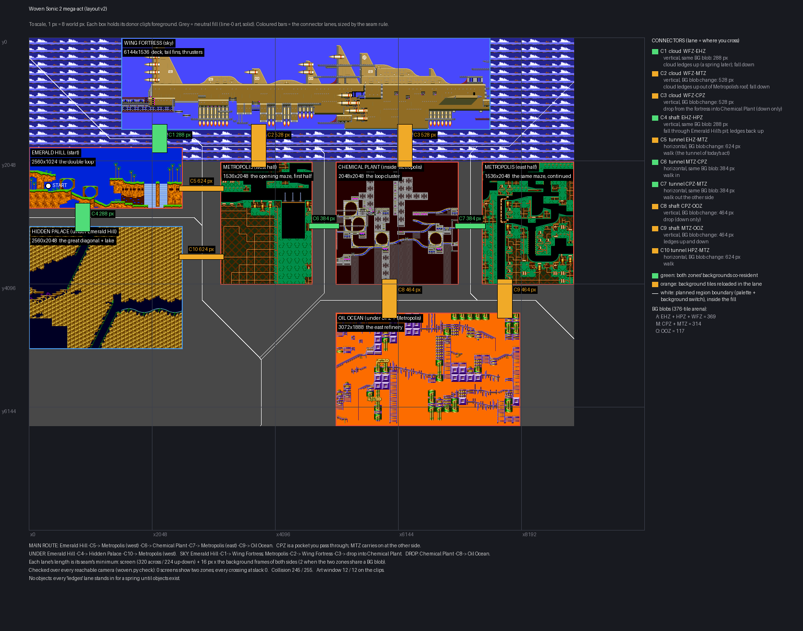

# The Sonic 2 mega-act, woven: layout v2 and its seams

**Date:** 2026-09-27. **Branch:** `design/mega-act-woven`, base `origin/master` `d1207465`
(at or after `e989ec7b`, checked with `git merge-base --is-ancestor`).
**Supersedes:** the LAYOUT of `docs/research/2026-09-27-mega-act-layout.md` (v1). v1's zone
conversion, collision equivalence and bake-gap findings still stand.
**Booking:** `docs/DEFERRED_WORK.md`, S2-COMPRESSED-ACT (pointer added there).
**Status:** a PROPOSAL. No engine file, no tool under `tools/` and no ROM byte changed. No
emulator was used, not even headless: every runtime number here is quoted from the 09-25
witnesses, and the report says so each time.

**The picture (v2.1):** [`2026-09-27-mega-act-woven/mega-act-woven.png`](2026-09-27-mega-act-woven/mega-act-woven.png).
It is drawn to scale (1 px = 8 world px), and each box holds a render of its donor clip. The
v2 picture this replaced is the same path at `1190d409`.



Every figure below is tagged:
- **MEASURED:** a command in §E printed it.
- **INFERRED:** arithmetic on measured numbers, or a reading of the source. The sentence says
  which.
- **QUOTED:** measured by an earlier parcel, whose report is named.

---

## v2.1 (revision r2, same day): Hidden Palace runs east

**Branch** `design/mega-act-woven-r2`, base `origin/master` `9e7519c6` (contains v2 at
`1190d409`). **This section supersedes** v2's Hidden Palace row and its C10 in §0, §A.2, §B
and the routes. Everything else below still stands as written, and every budget is re-measured
here.

**The owner, with a sketch:** *"can you do hidden palace zone so it goes under that section on
metropolis, can connect to it (where metropolis is above) and can connect to oil ocean to the
right of it?"*

### What changed

- **Hidden Palace is an L: ONE donor rectangle cut into two clips pasted with the same
  offset.**
  - **West piece**, under Emerald Hill: donor x 4688..7247, y 0..2047, at act (0, 3136),
    2560 x 2048. It holds the great diagonal.
  - **East piece**, under Metropolis west: donor x 7248..9215, y 1504..2047, at act
    (2560, 4640), 1968 x 544. It holds the zone's east floor, up to the end of its painted
    width (9216, MEASURED from `zone.json`).
  - **Why one rectangle cut in two, and not a wider clip or two separate pieces:**
    - **Not one wider rectangle.** Under Emerald Hill, Hidden Palace's top is at y 3136
      (288 below Emerald Hill). Under Metropolis west it cannot start above y 4640 (528 below
      Metropolis's bottom, a background reload). A single rectangle would have to start at
      4640 everywhere, which leaves a 1,792 px drop under Emerald Hill where the 288 px shaft
      is now.
    - **Not two separate pieces.** Two separate pieces would meet at a seam made up of two
      different parts of the donor.
    - **Same offset.** Cut from one rectangle with one offset, the place where the two pieces
      touch is Sonic 2's own geometry.
    - **No connector.** It is one zone, with one palette and one background, so nothing
      crosses and no connector is needed.
  - **Why this donor window.** The east piece has to end 576 px before Oil Ocean (the
    HPZ/OOZ rule), so the whole L is 4,528 px wide. Ending it at the donor's painted edge puts
    the west piece's start at 4688.
    - A scan over every start from 0 to 4688 in 256-px steps (MEASURED) found that only
      starts 4608 and 4688 keep collision at **245** (0 entries added). 4688 is the one
      that ends exactly at the painted edge.
    - Its east piece's top is open under Metropolis, and its east edge is open at the rows
      Oil Ocean's west edge is.
    - Other starts cost more (MEASURED):

      | Start | Entries |
      |---|---|
      | 4096 / 4352 | 250 / 246 |
      | 2048 | 255 (0 spare) |
      | 2304..3840 | 259, **over by 4**. These have more open ground in the east piece |
      | 0..1792 | 269 to 290 |
- **C10 is now a vertical shaft**, Hidden Palace east up to Metropolis west.
  - It is 528 px: 224 + 16 x (10 + 9), a background reload, because HPZ is in blob A and MTZ
    in blob M.
  - It sits at act x 3456..3711, where both edges are open (MEASURED, `woven.py edges`).
  - You climb ledges up into Metropolis (a spring later) and fall back down.
  - **v2's side tunnel between Hidden Palace and Metropolis is gone.** The owner's picture
    does not need it, and the L now fills that spot (under the C5 gap).
- **New C11, a tunnel from Hidden Palace east into Oil Ocean.**
  - It is 576 px: 320 + 16 x (10 + 6), a background reload.
  - It runs at y 4896, a row both edges have open (MEASURED).

### The background groups, re-checked

The new joins are HPZ/MTZ (vertical) and HPZ/OOZ (horizontal). Both cross groups: HPZ is in A
(EHZ + HPZ + WFZ), MTZ in M (CPZ + MTZ), and OOZ in O. The regroupings that fit the 376-tile
arena, priced with the §A.2 rule (INFERRED from the MEASURED tile counts):

| Grouping | EHZ/HPZ (C4) | HPZ/MTZ (C10) | HPZ/OOZ (C11) | Other changes | Verdict |
|---|---|---|---|---|---|
| **A {EHZ,HPZ,WFZ} 369, M {CPZ,MTZ} 314, O {OOZ} 117 (kept)** | **288** | 528 | 576 | none | **kept** |
| {EHZ,WFZ} 224, {HPZ,OOZ} 262, M | 464 | 496 | **384** | C5 624→576, C2/C3 528→480, C8/C9 464→496 | the showcase Emerald-Hill-on-Hidden-Palace shaft grows 288→464 |
| {EHZ,HPZ} 286, {WFZ,OOZ} 200, M | 288 | 512 | 576 | C1 288→480, C5 624→608, C2/C3 528→480, C8/C9 464→480 | the showcase Wing-Fortress-over-Emerald-Hill band grows 288→480 |
| any group with HPZ+MTZ | — | 288 | — | breaks CPZ+MTZ (C6/C7 384→ a reload) | rejected: the Chemical-Plant-inside-Metropolis seam is the showcase |
| {EHZ,HPZ,OOZ} | — | — | — | 403 tiles | over 376 |

**Recommendation: keep the three groups.** Both new joins reload a background, which is why
they are 528 and 576 rather than 288 and 384.

### Budgets, re-measured on v2.1

| Budget | v2 | v2.1 | Tag |
|---|---|---|---|
| Screens showing two zones (`woven.py check`, 264,594 reachable camera centres) | 0 | **0** | MEASURED |
| Crossing directions / slack | 18, all +0 | **20** (adds HPZ↔OOZ), all **+0** | MEASURED |
| Controls red | 4 of 4 | **6 of 6** (new: HPZ east 16 px up, C10 = 512, and 16 px wider, C11 = 560) | MEASURED |
| Collision attr entries | 245 of 255 | **245 of 255**. HPZ west adds 7 and HPZ east adds 0 (bake C2) | MEASURED |
| Art window, clips only | 12 of 12, 0 over | **12 of 12, 0 of 725,207 over**. Pool 2,659 tiles, 45 pages | MEASURED (bake N1/N2) |
| Art window with the connector art | 13 in 108 windows | **13 in the same 108 windows**, still at the MTZ/CPZ seam. Windows touching HPZ east need at most 8 (9 with the rock page) | MEASURED (`art_window.py`) |
| Sections | 20 of 48 (5 x 4) | **20 of 48** | MEASURED |
| Largest section tile map | 773 of 2,047 | **773**. Section 14 now holds four zones (MTZ, CPZ, HPZ, OOZ): 641 entries | MEASURED |
| Level data (clips only) | 306,786 B | **312,936 B** (+6,150): block stream 266,080, local maps 11,820, art pool 35,036 | MEASURED (`measure_rom.py`) |

**No budget breaks.** Collision was the likely one: the whole Hidden Palace is 152 entries.
The trade is the window choice above: a Hidden Palace window starting at donor x 2304..3840
has a roomier east piece but costs **259, 4 over**. Starting at 2048 fits exactly: 255, 0
spare.

### The one trade the owner may want: a taller east piece, with its lake

The east piece is Hidden Palace's bottom 544 px. The lake (donor y about 1100..1450) is just
above it, cut off by the 528 px rule under Metropolis west. The alternative is to shorten
Metropolis west to 1,536 px (dropping its bottom 512), set with `MTZ_WEST_H=1536` in
`build_layout.py`. MEASURED:

| | Default (recommended) | Trimmed Metropolis west |
|---|---|---|
| Metropolis west | 1536 x 2048 | 1536 x **1536** (bottom 512 px gone) |
| Hidden Palace east piece | 1968 x 544 at y 4640 | **1920 x 1056** at y 4128, **with the lake** |
| C11 | 576 | 624. The east piece now rises beside Chemical Plant, so it keeps the HPZ/CPZ rule |
| `woven.py check` | PASS | PASS, 0 mixed screens |
| Collision | 245 | 245 (`measure_clips.py union`) |

*Recommendation: the default.* Metropolis's maze is a must-pass and the lake is optional
scenery. It is the owner's call, and a one-line switch either way.

### Routes (v2.1)

- **Main (unchanged):** Emerald Hill, C5, Metropolis west, C6, through Chemical Plant, C7,
  Metropolis east, C9, Oil Ocean.
- **Under (new):** Emerald Hill, C4, Hidden Palace, which runs east inside the zone, then
  either:
  - **C10 up into Metropolis west**, a second way into the maze; or
  - **C11 across into Oil Ocean**, a second way to the end that skips Metropolis and
    Chemical Plant.
- **Sky (unchanged):** Emerald Hill C1, Metropolis west C2, Wing Fortress C3 drop into
  Chemical Plant.
- **Drop (unchanged):** Chemical Plant, C8, Oil Ocean.
- There are now **two ways to the end**: through the maze, or under it through Hidden Palace.

### What needs building: changes from §C

- **Nothing new.** C10 is now a shaft, and C11 is a tunnel into Oil Ocean; both kinds are
  already on the list:
  - C10 needs item 2's vertical kind;
  - C11 needs item 9 (K6 into a zone with no plane-B floor), which now blocks one more tunnel.
- **Two clips of one zone with one offset** already pass the manifest (R3 and R10) and the
  bake (MEASURED: `clip_manifest.py validate` OK, bake OK). The 2-D region plan (item 1) must
  treat them as one region.

---

## 0. The proposal in one screen

- **What the owner asked for.** He overlapped v1's thumbnails into a sketch:
  - Wing Fortress across the top, reached from several zones;
  - Emerald Hill on top of Hidden Palace;
  - Chemical Plant inside Metropolis, with Metropolis continuing on both sides;
  - Oil Ocean below Chemical Plant and Metropolis;
  - tunnels "as short as possible".
- **His clarification (mid-task).** *"we do need the tunnels still ... Maybe some clouds between
  wing fortress and the others or a tunnel or something ... Just that they're really close."*
  - So zones still never share a screen, and every meeting point has a connector.
  - The weaving is in the placement, and the work is the shortest correct connector for each
    kind of seam.
- **The act.** 9,072 x 6,464 px of content in a 5 x 4 section grid (20 of 48 sections), seven
  clips of six zones.
  - Wing Fortress spans the top.
  - Emerald Hill is at the left, with Hidden Palace directly under it.
  - To its right: Metropolis (west half), Chemical Plant, then Metropolis (east half), which
    is the same maze continuing on the far side.
  - Oil Ocean sits under Chemical Plant and Metropolis east.
- **Ten connectors**, each exactly as long as its seam needs:

  | Seam kind | Connectors | Length |
  |---|---|---|
  | Horizontal tunnel, both backgrounds already in memory | C6, C7 (Metropolis / Chemical Plant / Metropolis) | 384 px |
  | Vertical shaft or cloud band, both backgrounds already in memory | C4 (Emerald Hill / Hidden Palace), C1 (Wing Fortress / Emerald Hill) | 288 px |
  | Vertical, one background loaded in the lane | C8, C9 (down to Oil Ocean) | 464 px |
  | Vertical, one background loaded in the lane | C2, C3 (up to Wing Fortress) | 528 px |
  | Horizontal, one background loaded in the lane | C5 (Emerald Hill to Metropolis); v2's C10 is replaced in v2.1 | 624 px |

  - v1 used 832 px across and at least 768 px up or down everywhere.
- **Checked over every reachable camera position** (`woven.py check`, MEASURED):
  - 0 screens show two zones;
  - every crossing has a slack of 0 or more against the background-timing rule;
  - 4 of 4 controls (break the layout on purpose) turn it red.
- **Budgets on the real rectangles** (the real clip bake, MEASURED):

  | Budget | Result |
  |---|---|
  | Collision | **245 of 255** |
  | Art, clips only | worst camera window **12 of 12**, 0 of 725,207 over |
  | Section local maps | at most 773 of 2,047 |
  | Level data | 306,786 B (clips only) |

  - **Art with the connector art added:** **13 of 12 in 108 windows**, all at the Metropolis /
    Chemical Plant seam, if the tunnel's 28 tiles take a page of their own (§A.5). That is
    the one budget this layout does not clear yet.
- **Music.** All four new Sonic 2 songs are refused by today's importer (MEASURED). Six drum
  and envelope names have no declared mapping, and Hidden Palace also hits a packer limit
  (§A.8).
- **Fastest first woven screen: Chemical Plant inside Metropolis, as a one-row act.** The
  existing row bake already expresses it (INFERRED from `region_plan`). The one blocker is
  K6's tunnel-seam check, which refuses every floor at Metropolis's edge (MEASURED). That is a
  small item (§C).

### What I dropped when the owner clarified, and why

- **Palette merging and recolouring for zones side by side on one screen.** I had not started
  it. His clarification removed its reason, because no two zones share a screen.
- **Raster palette and background splits for stacked zones.** A research read was done, and
  the finding is kept in §A.1 as the reason zones do not share a screen today. It is not a
  proposal.

---

## A. The seams, measured

### A.1 Why two zones still never share a screen

The sketch first suggested stacked zones on one screen with a raster split. Here is what the
engine has for that (READ; file references are in the research read):

- **The HBlank effects vocabulary can move a split line with the camera.**
  - `patchable` fires take world-space lines through `Effects_LatchWorldLines`.
  - `fx_vscroll_split` changes plane B's vertical scroll from a line down; it ships.
- **It cannot swap a zone's palette at that line.**
  - A fire writes at most 3 CRAM words (`RASTER_BURST_MAX_CRAM = 3`, the measured
    122.9-cycle HBlank window).
  - A program is 64 words, which is about 6 to 8 fires.
  - There are 4 patch channels, and `patchable` binds exactly one fire each.
  - A zone's CRAM lines 1 to 3 are 45 colours, about 16 fires, and there is no second full
    palette source (variants are derived shift-and-bias transforms, 2 slots).
- **One background plane, one background at a time.** Nothing streams two layouts into one
  plane B.

So, as the owner has now asked, **every seam is a connector that hides one zone completely
before the next appears.** That is the rule the rest of this section prices.

### A.2 The connector rule, and the shortest correct connector for each seam

**What happens at a crossing (QUOTED: `docs/research/2026-09-25-shorter-connector.md` §2
and §8).** The camera centre crosses a region boundary, and in that frame:
- the palette snaps (with the `snap` override);
- the background switches:
  - if the new zone's background tiles are already in the 376-tile BG arena, only the plane
    is repainted, by DMA, and the visible rows are right **2 frames** later (QUOTED: measured on 09-25);
  - if they are not, the arena is overwritten first, one 1,824-B chunk a frame, then repainted.

The camera moves at most 16 px a frame on each axis (`CAM_MAX_X_STEP`, `CAM_MAX_Y_STEP`).
So a connector must hold the screen entirely inside itself for those frames, on both sides:

    horizontal:  G = 320 + 16 x (T_left + T_right)
    vertical:    G = 224 + 16 x (T_top  + T_bottom)
    T = 2 when the zone being entered shares a BG blob with the zone being left,
        otherwise ceil(blob bytes / 1824) + 3   (overwrite chunks, the 2-frame DMA wipe,
                                                 one slipped-DMA frame, as Z2 models it)

**Calibration.** At T = 2 a side, the horizontal rule gives 384 px. That is the tunnel
`crossing_witness.py` MEASURED glitch-free in 12 runs, with 0 frames of slack at the camera
cap (09-25 §8.4). The check tool (`woven.py`) is calibrated so that this case reads slack 0.
Its controls show it goes red at 16 px shorter.

**Background tiles per zone (MEASURED, `bg_tiles.py`):**

| Zone | BG tiles | Overwrite chunks | T into it, when its tiles are not in the arena (INFERRED) | Source of the count |
|---|---|---|---|---|
| EHZ | 141 | 3 | 6 | `clip_bg_lower.lower`, the bake's own list |
| CPZ | 237 | 5 | 8 | same |
| OOZ | 117 | 3 | 6 | same |
| MTZ | 77 | 2 | 5 | same |
| WFZ | 83 | 2 | 5 | same dedupe, worst 64-column window. `lower()` refuses WFZ (no horizontal repeat) |
| HPZ | 145 | 3 | 6 | same dedupe over `HPZ_BG.bin`, the one file `Hpz_Background:` includes. The file name is INFERRED-SOURCE: the loader refuses to guess the prototype's registry |

- **Every pair fits the 376-tile arena except CPZ + HPZ** (382 by sum).
- EHZ + CPZ is 378 by sum, but they share 2 tiles, so it is 376 exactly (QUOTED).
- All six zones total 800, so they cannot all be resident at once.
- **The layout therefore uses three BG blobs.** Zones in one blob are resident together, and
  a crossing between them costs only the 2-frame repaint:

  | Blob | Zones | Tiles | T into the blob from outside (INFERRED) |
  |---|---|---|---|
  | A | EHZ + HPZ + WFZ | 369 | 10 frames |
  | M | CPZ + MTZ | 314 | 9 frames |
  | O | OOZ | 117 | 6 frames |

**The shortest connector for each seam kind:**

| Seam | Shortest | Tag | What sets it |
|---|---|---|---|
| **Horizontal tunnel, same blob** | **384 px** (C6, C7) | MEASURED glitch-free before B-2 (09-25 §8.4) | The screen width (320), plus 2 frames of repaint a side at 16 px a frame |
| Same, on today's engine after B-2 | **480 px** | MEASURED (09-25 §8.7) | The background's vertical-scroll ratchet: a 3 to 4 frame slide at the camera cap. SHORT-TUNNEL-VSCROLL-RATCHET, not built. With it, back to 384 |
| **Vertical shaft or cloud band, same blob** | **288 px** (C1, C4) | INFERRED: the same rule on the 224-px axis. No vertical crossing between clip zones has been flown | The screen height (224), plus 2 x 2 frames |
| **Horizontal, blob change** | 320 + 16 x (T_a + T_b). **624 px** for A to M (C5); **576** for A to O (v2.1's C11) | INFERRED from the MEASURED chunk count and the QUOTED repaint | The arena overwrite of the blob being entered |
| **Vertical, blob change** | 224 + 16 x (T_a + T_b). **528 px** for A to M (C2, C3), **464 px** for M to O (C8, C9) | INFERRED, as above | As above |
| **Sealed seam** (the zones meet but nothing crosses) | **96 to 176 px** of neutral fill | MEASURED (`woven.py seal`) | Only the view distance. The camera inside a zone sees at most 160 + 16 across or 112 + 32 down past its own edge (screen half plus deadzone). No background time is needed, because nobody crosses |
| Zones touching with nothing between | **never**, for these clips | MEASURED | Every clip has reachable air at its edges: Sonic 2 levels run their pits to the bottom. Control `c_hpz_touch`: 6,416 camera positions show both zones |

Sealed separations, MEASURED (the smallest 16-px step with 0 mixed screens):

| Pair | Separation |
|---|---|
| EHZ over HPZ | 144 |
| CPZ over OOZ | 144 |
| MTZ beside CPZ | 176 |
| WFZ over EHZ | 96 (the deck's underside is sky nobody stands in) |

**Where two zones touch directly, is a connector needed at all?**
- **Where the player crosses: yes, always.** The screen must be all connector while the
  background changes.
- **Where the player does not cross:** only a thin neutral wall, 96 to 176 px.
- So "really close" is about 100 to 180 px between sealed edges, and 288 to 624 px where
  someone crosses.

**The levers that make connectors shorter (INFERRED, none built):**

| Lever | Effect | Cost |
|---|---|---|
| The ratchet exemption (SHORT-TUNNEL-VSCROLL-RATCHET, booked) | 480 back to 384 across. It is also needed for any same-blob vertical crossing between zones whose backgrounds scroll at different heights | S-M, engine, graded by `bg_vscroll_rate` |
| Overwrite 3,648 B a frame instead of 1,824 | Blob-change connectors shrink: A-M 624 to 528 across, 528 to 432 up/down; M-O 464 to 400 | S-M, engine. The VBlank DMA budget has to be measured first. The chunk size was derived to fit it |
| Smaller backgrounds | CPZ's 237 tiles is the most expensive one. Cropping it lets more zones share a blob | Content, a look call |
| A bigger BG arena (the VRAM re-cut) | Competes with the owner's 2026-09-07 "we can't have space for 0 objects" ruling | Owner |
| Region hysteresis (09-25 §8.3) | 32 px | Not built, and it trades in a glitch on reversal. Not recommended |

### A.3 The cloud band (new connector kind)

It works like a tunnel: a neutral strip that fully hides one zone before the next appears. It
is turned on its side to join Wing Fortress to the zones below it. Its requirements come from
the tunnel's (QUOTED from `s2_ehz_cpz`'s clips.json note and 09-25 §2.2):
- **Every pixel is opaque and on CRAM line 0.** Line 0 is the character's line, and no region
  install writes it. So neither the background nor the backdrop shows through, and the band
  looks the same under both zones' palettes.
- **The picture's band is a sample look.** It is Emerald Hill's own background sky and clouds,
  recoloured onto line 0 by the tunnel's nearest-colour rule, with transparent pixels painted
  line-0 $0E66 (a mid blue).
  - Line 0 has white ($0EEE), pale blue ($0ECC), lavender ($0CAA) and mid blue ($0E66), which
    is enough for clouds (MEASURED from `SonicAndTails.bin`).
  - The sample is **105 tiles, 2 pages** (MEASURED).
- **Crossing it:** falling through is free. Going up needs cloud ledges, which are top-solid
  platforms a jump apart. They stand in for springs until objects exist.
- **Height:** the vertical rule. 288 px where the blob is shared (over Emerald Hill); 528 px
  where it is not (over Metropolis and Chemical Plant).

### A.4 Timing check over the whole layout

`woven.py check` (MEASURED) walks every reachable camera centre on an 8-px grid (264,552
centres).

**How reachability is modelled:**
- **The player's positions:** plane-A air within jump reach above a floor, or below reachable
  air (falling), where the rolling ball fits, keeping the connected pieces. This is a column
  model and over-reaches, which makes the result conservative.
- **The camera:** within the deadzone of the player (16 across, 32 up and down), clamped to
  the act.
- **The regions:** the planned boundaries, balanced by each side's T.

**Result:**
- **MIXED** (a screen showing two zones): 0.
- **WRONG** (a zone on screen outside its own region): 0.
- **18 crossing directions**, every one at slack **+0 px**. The lengths are the rule's
  minimum, by construction.
- **VOID** (unpainted cells seen from a lane): 0.

`controls.py` breaks the layout four ways, and all four go red (MEASURED):

| Control | Result |
|---|---|
| Chemical Plant 16 px closer | slack -8 px a side |
| Metropolis out of Chemical Plant's blob | -72 px |
| Hidden Palace 64 px up | -32 px |
| Hidden Palace touching Emerald Hill | 6,416 mixed screens |

### A.5 The art window

`tools/clip_act_bake.py bake` on the clips-only draft (`draft_clips.json`, grid 6 x 4, see §C
item 8), MEASURED:
- **Worst camera window: 12 of 12 page frames, 0 of 725,207 windows over.** The pool is 2,714
  tiles in 46 pages.
- **Where:** the worst windows are at the Metropolis / Chemical Plant seam (camera 4784, 2624).
  A 640-px tile-cache window across a 384-px tunnel holds the edges of both zones.

**Connector art is not in the manifest.** It has no shaft or cloud kind, and K6 refuses every
tunnel into MTZ, HPZ or OOZ (§C item 9). So `art_window.py` adds it to the bake's own page
grid and re-counts with the bake's own counter (MEASURED on that model):

| What is counted | Worst window | Windows over budget |
|---|---|---|
| Clips only | 12 | 0 |
| Plus rock fill / tunnel sheet (28 tiles QUOTED from today's bake), charged as its own page | **13** | **108 of 725,207**, all at the C6 seam |
| Windows touching the cloud band (2 pages) | 11 (9 clips-only) | 0 |

- **The +1 is an upper bound.** In today's `s2_ehz_cpz` bake the placer packed the same sheet
  into a shared page (`pages_exclusive: 0`, MEASURED).
- **Moving Chemical Plant 32 or 64 px right** (a longer C6) left 64 and 14 windows at 13
  (MEASURED). The global page search moves the tightest seam around; it does not make room.
- **What would fix it, in order:**
  1. Bake the real tunnels, which needs K6 fixed (§C item 9), and see whether the placer packs
     the sheet.
  2. Trim the clips at that seam.
  3. One more page frame. That is VRAM the object re-cut ruling also wants.

The design's caveat still stands: 12 of 12 leaves nothing for object art.

### A.6 Collision

**245 of 255 attr entries** (the bake's C2 count, MEASURED). Entries added in bake order:

| Clip | Entries added |
|---|---|
| WFZ | 105 |
| EHZ | 81 |
| MTZ west | 3 |
| CPZ | 18 |
| MTZ east | 15 |
| HPZ | 7 |
| OOZ | 16 |

- Wing Fortress is 6,144 px wide here against v1's 4,096, and it costs no extra entries: the
  union is 245 either way (MEASURED).
- Splitting Metropolis into two halves costs nothing either.
- **Connector collision:**
  - Tunnels and fill use the bank's full block, which is already in the set (QUOTED from v1).
  - Cloud ledges would be a top-only full block, **+1 entry at most** (INFERRED).
  - That leaves about 9 spare.

### A.7 Sections, local maps, ROM

- **Sections: 20 of 48** (5 x 4). The bake measurement used 6 x 4, because the inherited OJZ
  entity pass refuses a section count that is not a multiple of 3 (v1 item 8). The extra
  column is empty.
- **Local maps (MEASURED):**
  - Three sections hold three zones (sections 7, 14 and 15).
  - The largest map is **773 of 2,047** entries.
- **Level data, clips only: 306,786 B (MEASURED, v1's `measure_rom.py`):**

  | Part | Bytes |
  |---|---|
  | Block stream | 259,198 |
  | Local maps | 11,640 |
  | Art pool | 35,948 |

  - v1 calibrated its harness at 160,742 B on today's `s2_ehz_cpz` (QUOTED), so this layout
    is about +146 KB.
  - That moves the clip act's own bank anchors (a routine re-derive), well inside the 4 MB map
    (INFERRED, as in v1).
- **Not counted:**
  - the painted neutral fill (a repeated sheet, which S4LZ compresses well, INFERRED);
  - backgrounds, palettes, regions and songs.

### A.8 Music

`music_probe.py` runs the four songs through the shipped S2 importer (MEASURED). The control
first: EHZ and CPZ re-convert byte-identical to the committed files.

| Song | Refused because | Size with size-only placeholder mappings |
|---|---|---|
| 90 HPZ | `dLowTom`, then a **packer** refusal: `NoteFill on non-FM route 8` | n/a |
| 8F WFZ | `dMidTimpani` x31, `dVLowTimpani` x38 | 1,501 + 128 B |
| 84 OOZ | `fTone_0C` (S2 PSG envelope 12 is not imported) | 2,872 + 192 B |
| 85 MTZ | `dClap`, `dScratch`, `dLowTom` | 2,875 + 192 B |

- The three songs that pack come to 7,760 B together.
- Bank room for them was not measured.
- The placeholders are for measuring size only. They are not a proposal for how those drums
  should sound.

---

## B. The woven layout

**Clips.** The rectangles are v1's where v1 had them. Wing Fortress is widened to span three
zones, and Metropolis's opening 3,072 px is cut into two halves with Chemical Plant between
them.

| Clip | Donor source (donor px) | Size | Act position | Route |
|---|---|---|---|---|
| Wing Fortress: deck, tail fins, thrusters | `s2disasm` WFZ, x 1024..7167, y 256..1791 | 6144 x 1536 | (1536, 0) | optional (sky) |
| Emerald Hill: the double loop | `s2disasm` EHZ, x 6144..8703, y 0..1023 | 2560 x 1024 | (0, 1824) | must, the start |
| Metropolis west: the opening maze, first half | `s2disasm` MTZ, x 0..1535, y 0..2047 | 1536 x 2048 | (3184, 2064) | must |
| Chemical Plant: the loop cluster | `s2disasm` CPZ, x 7168..9215, y 0..2047 | 2048 x 2048 | (5104, 2064) | must |
| Metropolis east: the same maze, continued | `s2disasm` MTZ, x 1536..3071, y 0..2047 | 1536 x 2048 | (7536, 2064) | must |
| Hidden Palace: the great diagonal and lake. **v2.1: an L, see the v2.1 section** | ~~`s2-simonwai-disasm` HPZ, x 5632..8191, y 0..2047~~ | 2560 x 2048 | (0, 3136) | optional |
| Oil Ocean: the east refinery | `s2disasm` OOZ, x 8192..11263, y 0..1887 | 3072 x 1888 | (5104, 4576) | must, the end |

**Connectors.**
- Every position above is derived from these lengths by `build_layout.py`; none is typed.
- The `draft_clips.json` beside this report validates under `clip_manifest.py` (R1-R12).
- Everything between clips that is not a lane is neutral fill: line 0, solid, rock grey
  below the sky and clouds within it.

| Id | Kind | Joins | Length | Why that length | How you cross |
|---|---|---|---|---|---|
| C1 | cloud band | WFZ / EHZ | 288 | vertical, blob A both sides | cloud ledges up (a spring later); fall down |
| C2 | cloud band | WFZ / MTZ west | 528 | vertical, A to M | ledges up out of Metropolis's roof; fall down |
| C3 | cloud band | WFZ / CPZ | 528 | vertical, A to M | drop from the fortress (down only) |
| C4 | shaft | EHZ / HPZ | 288 | vertical, blob A | fall through Emerald Hill's pit; ledges back up |
| C5 | tunnel | EHZ / MTZ west | 624 | horizontal, A to M | walk |
| C6 | tunnel | MTZ west / CPZ | **384** | horizontal, blob M | walk in |
| C7 | tunnel | CPZ / MTZ east | **384** | horizontal, blob M | walk out the other side |
| C8 | shaft | CPZ / OOZ | 464 | vertical, M to O | drop through CPZ's one open floor span |
| C9 | shaft | MTZ east / OOZ | 464 | vertical, M to O | ledges up and down |
| ~~C10~~ | ~~tunnel~~ | ~~HPZ / MTZ west~~ | ~~624~~ | ~~horizontal, A to M~~ | **v2.1: replaced by a 528-px vertical shaft HPZ east / MTZ west, plus the new C11 HPZ east / OOZ, 576 (see the v2.1 section)** |

**Mouths are placed on measured open edges** (`woven.py edges`: how far a camera in the clip
sees past each edge, per 256-px span). For example:
- C8 sits on Chemical Plant's only open floor span (donor x 7936..8191). Its other seven
  spans have 292 to 612 px of unreachable ground.
- Hidden Palace's top edge is open along its whole width.
- Metropolis west's east edge is open at every row.

The exact floor row of each tunnel is a build-time detail. At Metropolis west's east edge,
three rows are flush floors (donor y 640, 768 and 1664); K6 refuses them only because plane B
is empty (MEASURED, §C item 9).

**Routes.** Metropolis is the hub, and Oil Ocean is diagonally across the act from the start.
- **Main:** Emerald Hill, C5, Metropolis west, C6, **through Chemical Plant**, C7, Metropolis
  east, C9, Oil Ocean.
- **Under:** Emerald Hill, C4, Hidden Palace, C10, Metropolis west. This is a second way to
  Metropolis. **(v2.1: C10 is now a shaft up from Hidden Palace's east piece, and C11 adds
  Hidden Palace to Oil Ocean. See the v2.1 routes.)**
- **Sky:**
  - Emerald Hill, C1, Wing Fortress;
  - Metropolis west, C2, Wing Fortress;
  - Wing Fortress, C3, a drop into Chemical Plant.
  - So there are three ways into the sky, and one is a way down into the middle of the
    Chemical Plant pocket.
- **Drop:** Chemical Plant, C8, Oil Ocean. This is a shortcut past Metropolis east.

**What was traded, and why:**
- **Wing Fortress sits 288 px above Emerald Hill, but 528 px above Metropolis and Chemical
  Plant.** The zones under it are in another BG blob.
  - Putting Wing Fortress, Metropolis and Chemical Plant in one blob would need 397 tiles
    against 376 (INFERRED, sum of the MEASURED counts).
  - Splitting the fortress into two clips at two heights would break the ship.
- **Metropolis east has only one way in** from the main row (C7), plus C9 from below.

---

## C. What needs building

Sizes: **S** a day or less, **M** a few days, **L** a week or more (INFERRED from reading).
"Engine" means `.emp`; everything else is Python tooling or content. v1's §6 items keep their
numbers.

| # | Item | Where | Size | Woven status |
|---|---|---|---|---|
| 1 | **2-D region plan.** The regions as rectangles, planned by the balanced-slack rule `woven.py` uses, fill included. Two clips of one zone (MTZ) already chain in the row plan (READ: `region_plan` walks runs of `zone_key`) | `clip_rom_bake.py` `region_plan` | **L** | required |
| 2 | **Vertical connector kinds:** drop shaft, stair shaft, and the **cloud band** (opaque line-0 art, cloud ledges) | `clip_manifest.py`, `clip_act_bake.py` | **L** (+S for the cloud band on top of the shaft) | required |
| 3 | Z2 and the music check on both axes | `clip_rom_bake.py` | M | required |
| 4 | Walk every corridor, not `corr[0]` | `clip_rom_bake.py` | S | required |
| 5 | 2-D reachability | `clip_reachability.py` | M | required |
| 6 | **Neutral fill everywhere between clips** (v1's seal walls, generalised): solid, line 0, painted | new corridor-like kind | S-M | required |
| 7 | The clip act owns its start | `clip_rom_bake`, `act_descriptor` | S | required |
| 8 | Emit no inherited OJZ entities, which also lifts the multiple-of-3 section count | `ojz_entity_gen.py` | S | required |
| 9 | **K6 into a zone with no plane-B floor.** MEASURED blocker for **every** tunnel in this layout. At Metropolis west's east edge every floor row is refused; 3 of them only by "planes disagree (16 and 0)" | `clip_manifest.py` K6 | **S** | **first** |
| 10 | Layer lines accept HPZ (L1) and WFZ (L5) | `s2_layer_lines.py` | S | **DONE** (`parcel/woven-hpz-wfz-prep`): WFZ's object layout resolved per `gameRevision`, the prototype's Objects_Layout read for HPZ (a prototype Obj03 inside a clip is refused, L6). MEASURED: 0 Obj03 in WFZ_1, OOZ_1 and prototype HPZ_1, so all three clip with 0 lines; `plan()` gives 0 rows for the solo clips `s2_{ooz,wfz,hpz}_solo` |
| 11 | Backgrounds: HPZ's registry (145 tiles MEASURED from the file), WFZ's non-repeating sky (83 tiles MEASURED), scroll records for four zones | `clip_bg_lower`, `s2_donor`, `clip_bg_scroll` | M | **DONE for what a 512-row plane can hold** (`parcel/woven-hpz-wfz-prep`): HPZ 145 tiles, window 0, camY/2, 6 bands (3 ramp ratios at the nearest engine factor); OOZ 117 tiles, 12 bands incl. the reversed sun ripple; WFZ 18 tiles, window at BG row 896, 1:1, cloud rows DRIFT only (Sonic 2's bug, kept); MTZ's record came with `s2_mtz_cpz`. Solo clips `s2_{ooz,wfz,hpz}_solo` build both shapes and `clip_bg_scroll_witness` is exact on every probe (16/16, 16/16, 28/28). **Not done: the BG past the plane window.** The plane holds 512 BG rows and V-scroll clamps at 288, so HPZ's BG stops moving below act camera Y 576 (its BG is 1152 rows) and WFZ's outside camera Y 640..928 (the 83-tile sky, fortress rows included, is 2048 rows); OOZ holds to 1792. Booked WINDOWED-BG-VERTICAL-CLAMP |
| 12 | **Music:** decide 5 drum names and fTone 0C, import S2 PSG envelope 12, fix `NoteFill` on a PSG route for HPZ | `smps_import` tables, `gen_sound_tables`, `song_packer` | M, content | required (§A.8) |
| 13 | **The ratchet exemption** (SHORT-TUNNEL-VSCROLL-RATCHET) | `engine/level/parallax.emp` | S-M, engine | **needed for 384 / 288**; without it, 480 across |
| 14 | **BG blob groups:** `crossing_overrides.background = co_resident` generalised from one act-wide pair to per-region blobs (A, M, O). The engine already compares blob pointers (QUOTED 09-25 §3) | `clip_rom_bake.py` | M | required |
| 15 | Z1 counted on the screen, both axes. `woven.py check` is the model to promote into the bake, with per-pair T | `clip_rom_bake`, `clip_act_bake` | M | required |
| 16 | Per-region camera bounds | `camera.emp` | M | optional |
| 17 | CRAM line-0 cells (CPZ 168, WFZ 32) | content | S to accept | as v1 |
| W1 | **Art headroom at the MTZ / CPZ seam:** re-measure with real tunnels once item 9 lands; then trim or add a frame (§A.5) | bake, maybe VRAM | S to measure | required |
| W2 | Faster BG overwrite (optional lever, §A.2) | `engine/level/bg.emp` | S-M, engine | optional |
| W3 | **A pit in Hidden Palace's east piece** (found building item 10/11's solo clip, MEASURED from the donor words): donor x 8448..8703 has no art in y 1504..2047, and x 8352..8447 no plane-A landing surface. In the woven act Metropolis west paints those columns above, so `clip_reachability`'s art check passes, but the pit falls to the act's bottom. Needs a floor, a trimmed east piece, or the death plane | content | S | required, the owner's call |

**Total to a first playable woven act (INFERRED):**
- items 1 to 15 and W1: two L, six M, eight S;
- 16 and W2 are optional.

### The fastest first woven screen on the owner's screen

**Chemical Plant inside Metropolis, as a ONE-ROW act:** Metropolis west, a 384 tunnel,
Chemical Plant, a 384 tunnel, Metropolis east.

- **It needs almost nothing new.**
  - The row bake's `region_plan` already chains Metropolis, Chemical Plant, Metropolis
    (READ).
  - The `s2_ehz_cpz` crossing overrides give snap plus co-resident backgrounds. CPZ + MTZ is
    314 tiles against 376 (MEASURED sum).
  - Metropolis's background lowers (77 tiles) and it has no layer lines (MEASURED, v1).
- **It is blocked by one item, 9, K6 (S).** The probe (`row_probe`, §E) tried every floor
  row at Metropolis west's east edge, and every one was refused.
- Then a clips.json, `clip_anchors.py --derive`, and `S2CLIP=<name> ./build.sh`.
- **What the owner sees:** you run through a pocket of Chemical Plant and come out in the
  same Metropolis on the far side. It is weaving in one dimension.
- **Known caveat:** at 384 px, without item 13, the far background slides for 3 to 4 frames
  at the camera cap (QUOTED 09-25 §8.7). At 480 px it does not.
- **Estimate:** a day or two (INFERRED).

**Second: Emerald Hill on top of Hidden Palace** (the first vertical seam). It needs:
- a two-region vertical split (a small first cut of item 1);
- a drop shaft (the smallest part of item 2);
- Z2 vertical (part of item 3);
- items 10 and 11 for HPZ, and item 13;
- EHZ + HPZ co-resident (286 tiles, MEASURED sum).

About one to two weeks (INFERRED). Everything after that is the full list.

---

## D. The owner's choices

1. **Is this the shape?** Wing Fortress across the top, Emerald Hill over Hidden Palace,
   Chemical Plant as a pocket inside Metropolis, Oil Ocean under them.
   *Recommendation: yes.* The clip choices are one line each to change, and the seam rule
   re-derives every position.
2. **Which seams get the shortest connectors?** Backgrounds decide it. Zones that share a BG
   blob get 384 across or 288 up and down; others get 464 to 624. The blobs drawn make the
   showcase seams the short ones: Chemical Plant in Metropolis, Emerald Hill on Hidden Palace,
   Wing Fortress over Emerald Hill.
   *Recommendation: these blobs.*
3. **The cloud band's look (a look call).** An opaque bank of clouds on the character's
   palette line, drawn in the picture from Emerald Hill's own cloud art. It has to be opaque;
   see-through clouds would show the background changing.
   *Recommendation: accept this sample for the first build*, and repaint later if it reads
   wrong.
4. **The rock fill's look.** It is the tunnel's grey, and it is everywhere between zones: 96
   to 176 px where nothing crosses.
   *Recommendation: accept it for now.*
5. **384 with a brief background slide, or 480 with none?** At the camera cap only.
   *Recommendation: build the ratchet exemption (item 13).* Vertical crossings need it anyway.
6. **Springs.** Every "ledges" lane is a stand-in for a spring.
   *Recommendation: cloud ledges and stair ledges now; springs when objects arrive.*
7. **Music (the owner's ask).** The four songs need drum mappings: timpani (WFZ), low tom (HPZ
   and MTZ), clap and scratch (MTZ), and one PSG envelope (OOZ). HPZ also needs a converter
   fix.
   *Recommendation:* extend the S2CLIP-MUSIC-DRUMS "Sonic 3 drums" ruling to these names,
   the owner picking the S3K sample for each, as its own sound parcel.
8. **The art budget is at the limit.** 12 of 12, and 13 in 108 windows if the tunnel art gets
   its own page.
   *Recommendation: measure with real tunnels first (after item 9).* Trim the seam clips
   before asking for a page frame, which is VRAM the objects also want.
9. **A mixing seam (two zones on one screen)?** Not offered. The owner's clarification rules
   it out, and §A.1 says the engine would need new raster machinery for it.

---

## E. Reproduce

Scratch goes under `$HOME`. Only `measure_rom.py` touches the repo, and it saves and restores
`act_grid.emp` itself.

```bash
export TMPDIR=/home/volence/.cache/aeon-tmp
D=docs/research/2026-09-27-mega-act-woven
python3 tools/s2_zone_convert.py convert s2disasm@EHZ s2disasm@CPZ s2disasm@WFZ s2disasm@OOZ \
    s2disasm@MTZ s2-simonwai-disasm@HPZ            # 6 zones, 0 differing, 0 FAILED
python3 $D/bg_tiles.py                             # BG tiles per zone, pair sums
(cd $D && python3 build_layout.py)                 # layout.json from the seam rule
(cd $D && python3 woven.py check layout.json)      # MIXED 0, WRONG 0, 18 crossings slack +0, PASS
(cd $D && python3 controls.py)                     # 4 of 4 controls red
(cd $D && python3 woven.py edges s2disasm/CPZ 7168,0,2048,2048)       # per-edge view reach
(cd $D && python3 woven.py seal s2disasm/EHZ:6144,0,2560,1024 \
    s2-simonwai-disasm/HPZ:5632,0,2560,2048 --below)                    # 144 px
(cd $D && python3 woven.py manifest layout.json --grid 6 4 --out draft_clips.json)
python3 tools/clip_manifest.py validate $D/draft_clips.json            # OK, 9 W3 warnings
python3 tools/clip_act_bake.py bake $D/draft_clips.json --out ~/.cache/aeon-tmp/woven/bake
    # 245 of 255; worst 12 of 12, 0 of 725,207 over
python3 $D/art_window.py $D/layout.json ~/.cache/aeon-tmp/woven/bake    # 13 in 108 with connector art
python3 docs/research/2026-09-27-mega-act-layout/measure_rom.py $D/draft_clips.json \
    --scratch ~/.cache/aeon-tmp/woven/rom --salvador <main checkout>/tools/bin/salvador   # 306,786 B
python3 docs/research/2026-09-27-mega-act-layout/measure_clips.py union \
    s2disasm/EHZ:6144,0,2560,1024 s2disasm/CPZ:7168,0,2048,2048 \
    s2-simonwai-disasm/HPZ:5632,0,2560,2048 s2disasm/MTZ:0,0,1536,2048 \
    s2disasm/MTZ:1536,0,1536,2048 s2disasm/OOZ:8192,0,3072,1888 s2disasm/WFZ:1024,256,6144,1536  # 245
python3 $D/music_probe.py                          # 4 refusals; sizes with placeholders
(cd $D && python3 woven.py render layout.json --out mega-act-woven.png)
```

The one-row K6 probe (§C, "fastest first woven screen") was a scratch script. It is not
committed. It built the three-clip row with a 384-px tunnel at each floor row from 512 to
1776 and ran `clip_act_bake.py bake`: 80 of 80 rows REFUSED by K6 at x = 1535. Of those, 3
rows (640, 768, 1664) were refused as "planes disagree (16 and 0)" and 77 because there is no
flush floor on that row (71 with no ground on the row, 6 with ground in the row above).

**Files beside this report:**
- `woven.py`: the check, edge survey, seal search, manifest and render entry point.
- `build_layout.py`: builds the layout, deriving positions from the rule.
- `controls.py`: the four controls.
- `bg_tiles.py`: background tiles per zone.
- `art_window.py`: the art window with connector art.
- `music_probe.py`: the song importer probe.
- `render_woven.py`: the picture.
- `layout.json`, `draft_clips.json`: the inputs.
- `mega-act-woven.png`: the picture.

Measured on 2026-09-27 against base `d1207465`, with the converted trees from this run.
